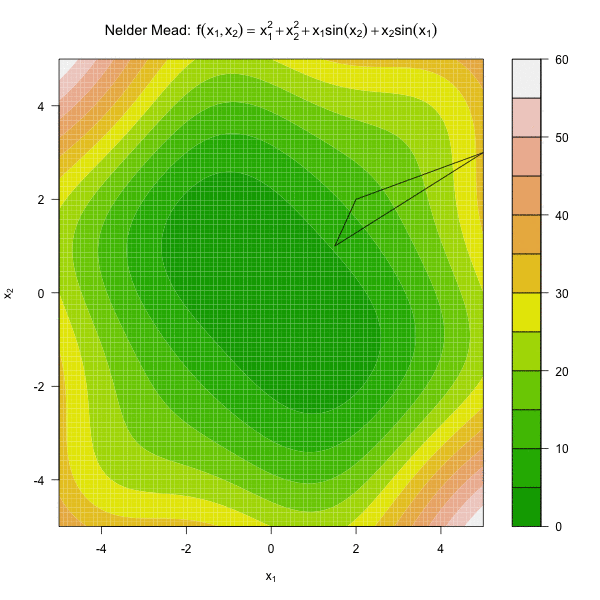

# 常见的优化算法 {#optim}


## 介绍 {#optim-intro}


## 牛顿优化算法

假设函数 $f(x)$ 可导并一阶导 $f^{\prime}(x)$ 连续，那么最大化 $f(x)$ 相当于求 $f^{\prime}(x) = 0$ 的根，我们就可以使用牛顿法求根。优化 $f(x)$ 就转化成了方程求根问题。 牛顿优化算法的迭代过程如下。

\centering
```{block, type='method'}
**牛顿优化算法**


1. 选择初始猜测点 $x_0$，设置 $n = 0$。
2. 按照以下迭代过程进行迭代：
\begin{equation}
x_{n+1}=x_{n}-\frac{f^{\prime}\left(x_{n}\right)}{f^{\prime\prime}\left(x_{n}\right)}.
\end{equation}
3. 计算 $|f^{\prime}(x_{n+1})|$。
    1. 如果 $|f^{\prime}(x_{n+1})| \leq \epsilon$，停止迭代；
    2. 否则，返回第 2 步。
```

上述优化过程的停止条件还可以为：

- $|x_{n} - x_{n-1}| < \epsilon$.

- $|f(x_{n}) - f(x_{n-1})| < \epsilon$.


```{example}
求 $f(x_1, x_2) = x_1^2 - x_1x_2 + x_2^2 + \exp(x_2)$ 的最小值。
```

```{r newton}
newton <- function(f, x0, tol = 1e-9, max.iter = 100) {
  x <- x0
  cat(paste0('初始值：','x1 = ',x[1],', x2 = ',x[2],'\n'))
  fx <- ftn(f, x)
  iter <- 0
  # xs用来保存每步迭代得到的x值
  xs <- list()
  xs[[1]] <- x
  # 继续迭代直到满足停止条件
  while((max(abs(fx$fgrad)) > tol) & (iter < max.iter)){
    x <- x - solve(fx$fhess, fx$fgrad)
    fx <- ftn(f, x)
    iter <- iter + 1
    xs[[iter + 1]] <- x
    cat(paste0('迭代第',iter,'次：x1 = ',x[1],', x2 = ',x[2],'\n'))
  }
  if (max(abs(fx$fgrad)) > tol){
    cat('算法无法收敛 \n')
  } else{
    cat('算法收敛\n')
    return(xs)
  }
}

ftn <- function(f, x){
  df <- deriv(body(f), c('x1', 'x2'), func = TRUE, hessian = TRUE)
  dfx <- df(x[1], x[2])
  f <- dfx[1]
  fgrad <- attr(dfx, 'gradient')[1,]
  fhess <- attr(dfx, 'hessian')[1,,]
  return(list(f = f, fgrad = fgrad, fhess = fhess))
}
f <- function(x1, x2) x1^2 - x1 * x2 + x2^2 + exp(x2)
```

```{r, echo=FALSE, fig.asp=1}
m <- as.data.frame(do.call(rbind, newton(f, c(5, 5))))
nx <- ny <- 100
xg <- seq(-5, 5, len = nx)
yg <- seq(-5, 5, len = ny)
g <- expand.grid(xg, yg)
z <- f(g[,1], g[,2])
f_long <- data.frame(x = g[,1], y = g[,2], z = z)
library(ggplot2)
cggplot(f_long, aes(x, y, z = z)) + 
  geom_contour_filled(aes(fill = stat(level)), bins = 50) + 
  guides(fill = FALSE) +
  geom_path(data = m, aes(x1, x2, z=0), col = 2, arrow = arrow()) +
  geom_point(data = m, aes(x1, x2, z=0), size = 3, col = 2) +
  xlab(expression(x[1])) +
  ylab(expression(x[2])) +
  ggtitle(parse(text = paste0('"牛顿优化算法： "', ' ~ f(x[1],x[2]) == ~ x[1]^2 - x[1] * x[2] + x[2]^2 + exp(x[2])'))) 
```


## Nelder Mead 算法

在很多实际应用问题中，待优化的函数不可导，这就需要不依赖于求导的优化算法，Nelder Mead 算法，是最常用的不依赖于求导的算法之一，也是 R 中 `optim()` 函数的默认算法。

Nelder Mead 算法的思路是计算目标函数 $f(\cdot)$ 在 $n$ 维单纯形顶点出的取值，其中 $n$ 为 $f(\cdot)$ 中的变量个数，所以 Nelder Mead 算法有时也被称为单纯形优化法。对于一个二维函数，单纯形即为三角形，三角形的每一个角是一个顶点。更一般的，$n$ 维单纯形有 $n + 1$ 个顶点。

图 \@ref(fig:simplex1) 展示了一个二维单纯形的例子。

```{r simplex1, fig.cap = "二维单纯形示例", echo=FALSE}
t0 <- data.frame(x1 = c(0.5, 1.5, 1), x2 = c(1, -1, 3))
s0 <- ggplot(data = t0, aes(x = x1, y = x2)) +
  geom_point(size = 2, color = 'red') + 
  geom_polygon(col = 'red', fill = NA) +
  ggtitle("") +
  xlab(expression(x[1])) +
  ylab(expression(x[2])) +
  xlim(c(0, 2)) + 
  ylim(c(-6,6)) 
s0
```

#### 第一步：求函数值 {-}

对每个单纯形的顶点 ${\mathbf x_j}$，计算函数值 $f({\mathbf x_j})$，其中 $j \in 1, 2, \cdots, n$，并将将所有顶点排序使得 $$f({\mathbf x_1})\leq f({\mathbf x_2})\leq\ldots\leq f({\mathbf x_{n+1}}).$$假设我们的目标是最小化 $f(\cdot)$，那么 $f({\mathbf x_{n+1}})$ 就是最差点。算法目标即使寻找更好的点来取代  $f({\mathbf x_{n+1}})$。

#### 第二步：计算中心点 {-}

去掉最差点 ${\mathbf x_{n+1}}$，计算剩下的 $n$ 个点的中心点，$${\mathbf x_0}=\frac{1}{n}\sum_{j=1}^{n}  {\mathbf x_j}.$$
对于一个二维单纯形，中点即为两点连线的中点。


#### 第三步：计算映射点 {-}


根据中点计算最差点的映射，得到映射点（Reflection Point）：
$${\mathbf x_r}={\mathbf x_0}+\alpha({\mathbf x_0}-{\mathbf x_{n+1}}),$$

通常取 $\alpha=1$，这种情况下映射点和最差点到中点的距离相等。算法的下一步则取决于 $f({\mathbf x_r})$  的取值大小。

1. $f({\mathbf x_1})\leq f({\mathbf x_r})<f({\mathbf x_n})$， 这种情况下 ${\mathbf x_r}$ 既不是最佳点也不是最差点，将 $\mathbf x_{n+1}$ 替换为 ${\mathbf x_r}$，形成新的单纯形，回到第一步。
    
2. $f({\mathbf x_r})<f({\mathbf x_1})$，即 ${\mathbf x_r}$ 为最佳点，那么在这个方向上继续延伸，得到延伸点（Expansion Point）：
$$ {\mathbf x_e}={\mathbf x_0}+\gamma({\mathbf x_r}-{\mathbf x_0})，$$ 通常取 $\gamma = 2$。计算  $f({\mathbf x_e})$。
    - 如果 $f({\mathbf x_e}) < f({\mathbf x_r})$，那么延伸点比映射点更优，用延伸点 ${\mathbf x_e}$ 形成新的单纯形。
    - 如果 $f({\mathbf x_r})\leq f({\mathbf x_e})$，用映射点 ${\mathbf x_r}$ 形成新的单纯形。
    


    
3. $f({\mathbf x_r})\geq f({\mathbf x_n})$，即 ${\mathbf x_r}$ 为最差点，这意味着在 ${\mathbf x_{n+1}}$ 和 ${\mathbf x_{r}}$ 之间可能存在谷点，这时寻找收缩点（contraction point）：$${\mathbf x_c}={\mathbf x_0}+\rho({\mathbf x_{n+1}}-{\mathbf x_0})，$$通常取 $\rho=0.5$。
    - 如果 $f({\mathbf x_c}) < f({\mathbf x_{n+1}})$，那么用收缩点 ${\mathbf x_c}$ 形成新的单纯形。
    - 如果 $f({\mathbf x_c}) \geq f({\mathbf x_{n+1}})$，说明收缩无效，需要一个更小的单纯形，这时将 ${\mathbf x_{1}}$ 以外的点按以下方式压缩（shrink）：
    $${\mathbf x_i}={\mathbf x_1}+\sigma({\mathbf x_i}-{\mathbf x_1})，$$通常取 $\sigma = 0.5$，得到新的单纯形后返回第一步。
  


由此可见，Nelder Mead 算法只用到了函数值，不依赖于求导函数，是一种比较稳健的优化算法。图 \@ref(fig:nelder) 展示了 Nelder Mead 算法优化函数 $f(x_1, x_2) = x_1^2 + x_2^2 + x_1\sin(x_2) + x_2\sin(x_1)$。

```{r nelder, echo=FALSE, fig.cap="单纯形法优化动图"}

```


#### 停止条件 {-}

由图 \@ref(fig:nelder) 可见，随着迭代过程，单纯形的体积越来越小，因此通常将单纯形的体积足够小做为Nelder Mead。有 $n+1$ 个顶点的单纯形的体积为： $$\frac{1}{2}|\mathrm{det}(\tilde{X})|,$$其中 $$\tilde{X}=\left({\mathbf x_1}-{\mathbf x_{n+1}},{\mathbf x_2-{\mathbf x_{n+1}}},\ldots, {\mathbf x_{n}-{\mathbf x_{n+1}}}\right).$$


在 R 中，Nelder Mead 算法可以用 `optim()` 实现。

## 随机梯度下降算法

### 梯度下降算法


梯度下降（Gradient Descent，或者 Steepest Descent）算法是一种迭代算法。对于一个 $n$ 元连续可导函数 $f(\mathbf{x})$，在 $\mathbf{x}_n$ 处 $f(\mathbf{x})$下降最快的方向也就是$f(\mathbf{x})$ 在 $\mathbf{x}_n$ 处的梯度方向的反方向，即$-f^{\prime}(\mathbf{x}_n)$，这也是与 $\mathbf{x}_n$ 处等高线正交的方向。所以给定当前 $\mathbf{x}_n$，梯度下降算法的更新策略就是：
\begin{equation}
\mathbf{x}_{n+1}=\mathbf{x}_{n}-\alpha f^{\prime}\left(\mathbf{x}_{n}\right),
(\#eq:gd)
\end{equation}

其中 $\alpha > 0$  控制下降步长。如果我们的初始猜测为 $\mathbf{x}_0$，那么根据公式 \@ref(eq:gd)，我们可以得到 $f(\mathbf{x}_0) \geq f(\mathbf{x}_1) \geq f(\mathbf{x}_2) \geq \cdots$，如果算法收敛，序列 $\{\mathbf{x}_n\}$ 就会收敛到 $f(\mathbf{x})$ 的局部极小值。

```{r gd-1, echo=FALSE, fig.cap='梯度下降算法：一元函数'}
library(ggplot2)
f <- function(x) x^2 - 5
gd.eg1 <- data.frame(x = 4:1, y = f(4:1))
ggplot(data.frame(x=c(-5, 5)), aes(x)) + 
  stat_function(fun=f) + 
  geom_path(data= gd.eg1, aes(x = x, y = y), arrow = arrow(), color = 'red')+
  geom_point(data = gd.eg1, aes(x = x, y = y), color = 'red', size = 2) + 
  ggtitle(parse(text = paste0(' ~ f(x) == ~ x^2 - 5'))) + xlab(expression(x)) +
  ylab(expression(f(x))) 
```


```{r gd, fig.cap='梯度下降算法：二元函数', fig.asp=1, echo=FALSE}
f <- function(x, y) { x^2 + y ^2}
dx <- function(x,y) {2*x }
dy <- function(x,y) {2*y}
num_iter <- 10
learning_rate <- 0.2
x_val <- 6
y_val <- 6

updates_x <- c(x_val, rep(NA, num_iter))
updates_y <- c(y_val, rep(NA, num_iter))
updates_z <- c(f(x_val, y_val), rep(NA, num_iter))

# parameter updates
for (i in 1:num_iter) {

  dx_val = dx(x_val,y_val)
  dy_val = dy(x_val,y_val)

  x_val <- x_val-learning_rate*dx_val
  y_val <- y_val-learning_rate*dy_val
  z_val <- f(x_val, y_val)

  updates_x[i + 1] <- x_val
  updates_y[i + 1] <- y_val
  updates_z[i + 1] <- z_val
}

## plotting
m <- data.frame(x = updates_x, y = updates_y)
x <- seq(-6, 6, length = 100)
y <- x
g <- expand.grid(x, y)
z <- f(g[,1], g[,2])
f_long <- data.frame(x = g[,1], y = g[,2], z = z)
library(ggplot2)
ggplot(f_long, aes(x, y, z = z)) + 
  geom_contour_filled(aes(fill = stat(level)), bins = 50) + 
  guides(fill = FALSE) +
  geom_path(data = m, aes(x, y, z=0), col = 2, arrow = arrow()) +
  geom_point(data = m, aes(x, y, z=0), size = 3, col = 2) +
  xlab(expression(x[1])) +
  ylab(expression(x[2])) +
  ggtitle(parse(text = paste0('~ f(x[1],x[2]) == ~ x[1]^2 + x[2]^2'))) 
```

值得注意的是，通常情况下梯度反方向迭代是符合逻辑的，但是当待优化函数中的某些参数存在高度相关关系时，梯度下降算法的收敛速度可能会降低。

```{r gd-cor, fig.cap='梯度下降算法（变量高度相关的情况）', fig.asp=1, echo=FALSE}
f <- function(x, y) { x^2 + y^2 - 1.6*x*y}
dx <- function(x,y) { (2*x - 1.6*y)}
dy <- function(x,y) { (2*y - 1.6*x)}
num_iter <- 20
learning_rate <- 0.42
x_val <- 0
y_val <- 4

updates_x <- c(x_val, rep(NA, num_iter))
updates_y <- c(y_val, rep(NA, num_iter))
updates_z <- c(f(x_val, y_val), rep(NA, num_iter))

# parameter updates
for (i in 1:num_iter) {

  dx_val = dx(x_val,y_val)
  dy_val = dy(x_val,y_val)

  x_val <- x_val-learning_rate*dx_val
  y_val <- y_val-learning_rate*dy_val
  z_val <- f(x_val, y_val)

  updates_x[i + 1] <- x_val
  updates_y[i + 1] <- y_val
  updates_z[i + 1] <- z_val
}

## plotting
m <- data.frame(x = updates_x, y = updates_y)
x <- seq(-5, 5, length = 100)
y <- seq(-5, 5, length = 100)
g <- expand.grid(x, y)
z <- f(g[,1], g[,2])
f_long <- data.frame(x = g[,1], y = g[,2], z = z)
library(ggplot2)
ggplot(f_long, aes(x, y, z = z)) + 
  geom_contour_filled(aes(fill = stat(level)), bins = 50) + 
  guides(fill = FALSE) +
  geom_path(data = m, aes(x, y, z=0), col = 2, arrow = arrow()) +
  geom_point(data = m, aes(x, y, z=0), size = 3, col = 2) +
  xlab(expression(x[1])) +
  ylab(expression(x[2])) +
  ggtitle(parse(text = paste0(' ~ f(x[1],x[2]) == ~ x[1]^2 + x[2]^2 - 1.6*x[1]*x[2]'))) 
```

```{example}
用梯度下降算法建立一元线性回归模型。
```

