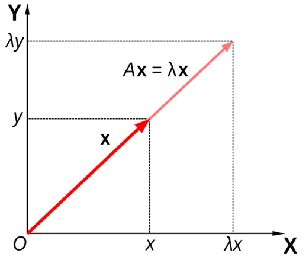
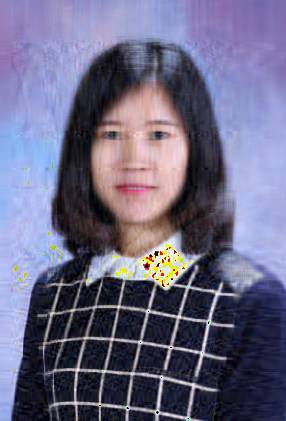

# 现代线性代数方法 {#matrices}
 
矩阵无处不在，比如任何可以放在 Excel 电子表格中的东西都是矩阵，文本和图像也可以用矩阵表示，线性回归的估计可以通过矩阵运算得到，谷歌的页面排序是通过特征分解来计算的。随着 5G 时代的到来及数据的爆发式增长，传统的线性代数方法很难完成大规模计算，因此，了解**矩阵计算的数值算法**及其应用，可以帮助提供更高效的解决方案。例如，近似矩阵计算通常比精确矩阵计算快几千倍。[20世纪的十大科学与工程算法](http://pi.math.cornell.edu/~web6140/)就包括矩阵分解方法和 QR 算法（我们将要在后续章节中介绍）。


##  特征分解

### 特征分析

一般来讲，一个 $n \times n$ 的矩阵 $A$ 乘以一个向量 $x$ 之后得到的向量 $Ax$ 既改变 $x$ 的长度，也改变其方向。但是，存在某些向量 $x$，使得 $Ax$ 只改变 $x$ 的长度而不改变其方向：即满足 $Ax = \lambda x$，那么 $\lambda$ 是 $A$ 的特征值，$x$ 是其特征向量。在二维情况下的特征分析（eigenanalysis）过程如图~\@ref(fig:eigen)~所示^[来源：https://en.wikipedia.org/wiki/Eigenvalues_and_eigenvectors]。

```{r eigen, fig.cap='二维矩阵的特征分析', echo=FALSE, fig.align='center'}

```

### 谷歌页面排序（PageRank）算法


### 矩阵的特征分解过程

特征分解（eigendecomposition）又叫谱分解（Spectral decomposition），是把一个矩阵根据其特征值和特征向量分解的过程。只有可以正交化的矩阵才可以进行特征分解。

如果 $n \times n$ 的矩阵 $A$ 具有 $n$ 个线性独立的特征向量，那么 $A$ 是可以正交化的，此时 $A$ 的特征分解为：

$$A = Q \Lambda Q^{-1},$$
其中 $Q$ 是一个 $n \times n$ 的方阵，其第 $i$ 列对应 $A$ 的第 $i$ 个特征向量 $q_{i}$，$\Lambda$ 是一个对角阵，其对角线上的元素对应 $A$ 的 $n$ 个特征值：$\Lambda_{ii} = \lambda_{i}$。

注意：只有可以正交化的矩阵才可以进行上述特征分解。

如果 $A$ 是一个 $n \times n$ 的实对称阵，那么

1. $A$ 的 $n$ 个特征根都为实数。
2. $A$ 有 $n$ 个互相正交的特征向量。

因此，一个实对称矩阵 $A$ 是可以正交化的，也就可以进行特征分解。

如果矩阵 $A$ 不可以对角化，那么可以通过 Schur 分解将其进行三角化：

$$A = QUQ^{-1},$$
其中 $Q$ 是一个正交阵，$U$ 是一个上三角矩阵，其对角线上的元素对应 $A$ 的特征值。


### 特征分解可以帮助我们做什么？

#### 矩阵快速求逆 {-}

根据非奇异方阵 $A$ 特征分解的过程，我们很容易可以得到：

$$A^{-1} = Q\Lambda^{-1} Q^{-1},$$
因为 $\Lambda$ 是对角阵，它的逆 $\Lambda^{-1}$ 也是对角阵。

#### 矩阵快速幂运算 {-}

特征分解可以帮助简化矩阵的幂运算，假设 $f(x) = a_0 + a_1x + a_2x^2$，我们可以得到：

$$f(A) = Qf(\Lambda)Q^{-1},$$
因为 $\Lambda$ 是对角阵，$f(\Lambda)$ 也是对角阵，其对角线上的元素 $[f(\Lambda)]_{ii} = f(\lambda_i)$。据此，我们很容易就可以计算矩阵 $A$ 的高次方。以 $A^{20}$ 为例：

$$A^{20} = Q\Lambda^{20}Q^{-1}.$$


## 奇异值分解

对于一个方阵 $A$ 而言，是可以对角化或者三角化的。这在矩阵计算中非常有用。但是对于一个非方阵而言，我们并不能对其进行特征分解，这个时候我们怎么办呢？在本节中，我们将学习对任何矩阵适用的矩阵分解方法 --- 奇异值分解 (Singular Value Decomposition，简称 SVD)。

###  奇异值（Singular values）和奇异向量（Singular vectors）

奇异值 $\sigma$ 是矩阵$A^TA$（对称方阵）特征根的平方根。对应的一对奇异向量（$u$ 和 $v$）满足

$$A v = \sigma u.$$

我们可以将矩阵的特征分解拓展，矩阵 $A$ 的特征分解 $A=Q\Lambda Q^T$ 对每个特征值只涉及到一个特征向量，我们如果将其拓展到奇异值和奇异向量，就有了一个一般矩阵的奇异值分解方法。


### 奇异值分解 

对于 $A \in \mathcal{R}^{m \times n}$，假设 $m \geq n$，那么存在正交阵

$$U = [u_1, \cdots, u_m] \in \mathcal{R}^{m\times m}$$ 和

$$V = [v_1, \cdots, v_n] \in \mathcal{R}^{n\times n},$$

使得

\begin{equation}
U^TAV = \Sigma = \text{diag}\{\sigma_1, \cdots, \sigma_p\} \in \mathcal{R}^{m\times n},
(\#eq:svd)
\end{equation}

其中 $p = \min\{m, n\}$， $\sigma_1 \geq \dots \geq \sigma_p \geq 0$。$\Sigma$ 是一个对角阵，对角线上的非负元素降序排列，其最后 $m - n$ 行的元素为零。 $\sigma_j$ 为奇异值，$u_j$ 和 $v_j$ 分别为左右奇异向量。


公式 \@ref(eq:svd)经过变换，我们可以得到 

\begin{equation}
A = U\Sigma V^T.
(\#eq:svd1)
\end{equation}


因为 $\Sigma$ 的最后 $m - n$ 行的元素为零，因此 SVD 分解也可以写为

\begin{equation}
A = U\Sigma V^T = \left(\begin{array}{cc}U_1 & U_2\end{array}\right) \left(\begin{array}{cc}
   D & \\
    & 0
   \end{array}\right) \left(\begin{array}{cc}V_1^T & V_2^T\end{array}\right) = U_1^TDV_1^T,
   (\#eq:svd2)
 \end{equation}
其中 $D = \text{diag}\{\alpha_1, \cdots, \alpha_r\} \in \mathcal{R}^{r\times r}$，$\sigma_r > 0$，$r = \text{rank}(A)$。


### 奇异值分解的一些性质 


- $A$ 的非零奇异值是 $A^TA$ 和 $AA^T$ 的非零特征根的平方根。
- $A$ 的秩等于其非零奇异值的个数。
- $A^TA$ 的奇异度（degree of singularity）可以通过条件值（condition number）$\kappa$ 来测量：

$$\kappa = \frac{\text{max singular value}}{\text{min singular value}}.$$

## 奇异值分解的应用


### 矩阵的低秩估计

根据公式 \@ref(eq:svd2)，$A$ 也可以写成外积加和形式

$$A = \Sigma_{i = 1}^r \sigma_i u_u v_i^T = \alpha_1 u_1 v_1^T + \cdots + \alpha_r u_r v_r^T.$$
如果我们只取前 $k,~ 1 \leq k \leq r$ 个加和，我们可以得到

$$A_k = \Sigma_{i = 1}^{k < r} \sigma_i u_u v_i^T = \alpha_1 u_1 v_1^T + \cdots + \alpha_k u_k v_k^T,$$
其中 $A_k$ 的秩为 $k$。如果奇异值 $\sigma_{k+1}, \cdots, \sigma_r$ 很小的话，$A$ 和 $A_k$ 之间的差别即 $A - A_k$ 也很小。并且 $||A - A_k|| = \sigma_{k+1}$，这通常被用作矩阵低秩估计的误差（Matrix Approximation Error）。这说明如果 $\sigma_{k+1}$ 很小的话，用 $A_k$ 来估计 $A$ 就相当精确。


### 图像压缩

在许多应用（如网页设计）中，我们经常需要传输和存储图像。图像越小，传输和存储的成本就越低。因此，我们经常需要应用数据压缩技术来减少图像所消耗的存储空间。一种方法是对图像矩阵进行奇异值分解（SVD）。通过对图像矩阵的低秩估计，来完成图像压缩。对于一个 $m\times n$ 的矩阵 $A$，其存储大小为 $m\times n$ 个像素点，经过压缩后的 $A_k$，存储像素点变为 $m\times k + k + k\times n = k \times (1 + m + n)$。

```{example}
基于矩阵的低秩估计对以下本书作者进行压缩。
<p float="center">
   
</p>
```


```{r, eval=TRUE, echo=FALSE}
library(jpeg)
ykang <- readJPEG('./figs/ykang.jpg')
r <- ykang[,,1]
g <- ykang[,,2]
b <- ykang[,,3]
ykang.r.svd <- svd(r)
ykang.g.svd <- svd(g)
ykang.b.svd <- svd(b)
rgb.svds <- list(ykang.r.svd, ykang.g.svd, ykang.b.svd)
for (j in seq.int(4, 200, length.out = 8)) {
  a <- sapply(rgb.svds, function(i) {
    ykang.compress <- i$u[,1:j] %*% diag(i$d[1:j]) %*% t(i$v[,1:j])
  }, simplify = 'array')
  writeJPEG(a, paste('./figs/', 'ykang_svd_rank_', round(j,0), '.jpg', sep=''))
}
```
以下四张压缩后的图像的秩分别为 200、116 和 32。他们分别需要存储多少个像素点？和原图像相比，他们分别的压缩比例又是多少？

<p float="center">
   
  
  
</p>

### 伪逆

### 曲线拟合


## 数值方法


