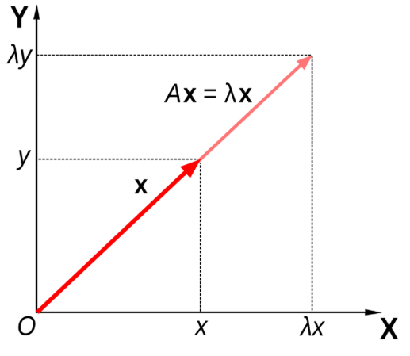
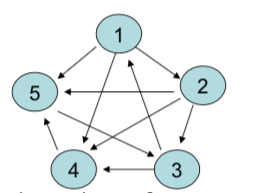

# 现代线性代数方法 {#matrices}

## 介绍


矩阵在求解线性方程式方面有着悠久的应用历史，但直到1800年代才被称为数组。中文于公元前10至2
世纪写成的《九章算术》是使用数组方法求解联立方程的第一个例子，《九章算术》甚至包括行列式概
念。 1545年，意大利数学家杰拉莫莫·卡尔达诺（Gerolamo Cardano）出版了Ars Magna，将这种方法
带到了欧洲。日本数学家关树（Seki）在1683年使用相同的数组方法求解联立方程。荷兰数学家扬·德·
维特（Jan de Witt）在1659年出版的《曲线的元素》（Elements of Curves，1659年）一书中使用数
组表示变换。在1700年至1710年之间，Gottfried Wilhelm Leibniz公开了使用数组来记录信息或解决
方案，并尝试了50多种不同的数组系统。

据记载，詹姆士·约瑟夫·西尔维斯特（James Joseph Sylvester）在1850年提出了“矩阵”一词（拉丁语
为“子宫”，源自母体），他将矩阵理解为对象。有趣的是，现代编程软件普遍把矩阵认为是对象。


矩阵无处不在，比如任何可以放在 Excel 电子表格中的东西都是矩阵，文本和图像也可以用矩阵表示，
线性回归的估计可以通过矩阵运算得到，谷歌的页面排序是通过特征分解来计算的。随着 5G 时代的到
来及数据的爆发式增长，传统的线性代数方法很难完成大规模计算，因此，了解**矩阵计算的数值算法
**及其应用，可以帮助提供更高效的解决方案。例如，近似矩阵计算通常比精确矩阵计算快几千倍。
[20世纪的十大科学与工程算法](http://pi.math.cornell.edu/~web6140/)就包括矩阵分解方法和 QR
算法（我们将要在后续章节中介绍）。


矩阵计算通常可以使用不同的技术方法，比如直接算法或迭代方法。例如，可以通过找到当$n$趋于无
穷大时收敛到特征向量的向量$x_n$的序列来获得方阵的特征向量。为了针对每个特定问题选择最合适
的算法，重要的是确定所有可用算法的有效性和精度。研究这些问题的领域称为数值线性代数。在许多
实际情况下，一个重要的矩阵是稀疏矩阵，即大多数条目为零的矩阵。例如，针对共轭梯度法，有专门
针对稀疏矩阵$A$求解线性系统$Ax = b$的算法。

几乎所有当前使用的编程语言都提供矩阵运算。矩阵操纵是计算机最早的数值应用之一。最初的
Dartmouth BASIC语言自1964年第二版实施以来就在阵列中内置了用于矩阵算术的命令。早在1970年代，
某些工程台式计算机（例如HP 9830）就装有ROM盒，以添加用于矩阵的BASIC命令。某些计算机语言
（例如APL）被设计为处理矩阵，并且各种数学程序可用于辅助矩阵计算。

##  特征分解

### 特征分析

一般来讲，一个 $n \times n$ 的矩阵 $A$ 乘以一个向量 $x$ 之后得到的向量 $Ax$ 既改变 $x$ 的长度，也改变其方向。但是，存在某些向量 $x$，使得 $Ax$ 只改变 $x$ 的长度而不改变其方向：即满足 $Ax = \lambda x$，那么 $\lambda$ 是 $A$ 的特征值，$x$ 是其特征向量。在二维情况下的特征分析（eigenanalysis）过程如图~\@ref(fig:eigen)~所示^[来源：https://en.wikipedia.org/wiki/Eigenvalues_and_eigenvectors]。

```{r eigen, fig.cap='二维矩阵的特征分析', echo=FALSE, fig.align='center', out.width = "50%"}

```


### 矩阵的特征分解过程

特征分解（eigendecomposition）又叫谱分解（Spectral decomposition），是把一个矩阵根据其特征值和特征向量分解的过程。只有可以正交化的矩阵才可以进行特征分解。

如果 $n \times n$ 的矩阵 $A$ 具有 $n$ 个线性独立的特征向量，那么 $A$ 是可以正交化的，此时 $A$ 的特征分解为：

$$A = Q \Lambda Q^{-1},$$
其中 $Q$ 是一个 $n \times n$ 的方阵，其第 $i$ 列对应 $A$ 的第 $i$ 个特征向量 $q_{i}$，$\Lambda$ 是一个对角阵，其对角线上的元素对应 $A$ 的 $n$ 个特征值：$\Lambda_{ii} = \lambda_{i}$。

注意：只有可以正交化的矩阵才可以进行上述特征分解。

如果 $A$ 是一个 $n \times n$ 的实对称阵，那么

1. $A$ 的 $n$ 个特征根都为实数。
2. $A$ 有 $n$ 个互相正交的特征向量。

因此，一个实对称矩阵 $A$ 是可以正交化的，也就可以进行特征分解。

如果矩阵 $A$ 不可以对角化，那么可以通过 Schur 分解将其进行三角化：

$$A = QUQ^{-1},$$
其中 $Q$ 是一个正交阵，$U$ 是一个上三角矩阵，其对角线上的元素对应 $A$ 的特征值。


### 特征分解可以帮助我们做什么？

#### 矩阵快速求逆 {-}

根据非奇异方阵 $A$ 特征分解的过程，我们很容易可以得到：

$$A^{-1} = Q\Lambda^{-1} Q^{-1},$$
因为 $\Lambda$ 是对角阵，它的逆 $\Lambda^{-1}$ 也是对角阵。

#### 矩阵快速幂运算 {-}

特征分解可以帮助简化矩阵的幂运算，假设 $f(x) = a_0 + a_1x + a_2x^2$，我们可以得到：

$$f(A) = Qf(\Lambda)Q^{-1},$$
因为 $\Lambda$ 是对角阵，$f(\Lambda)$ 也是对角阵，其对角线上的元素 $[f(\Lambda)]_{ii} = f(\lambda_i)$。据此，我们很容易就可以计算矩阵 $A$ 的高次方。以 $A^{20}$ 为例：

$$A^{20} = Q\Lambda^{20}Q^{-1}.$$


## 奇异值分解

对于一个方阵 $A$ 而言，是可以对角化或者三角化的。这在矩阵计算中非常有用。但是对于一个非方阵而言，我们并不能对其进行特征分解，这个时候我们怎么办呢？在本节中，我们将学习对任何矩阵适用的矩阵分解方法 --- 奇异值分解 (Singular Value Decomposition，简称 SVD)。

###  奇异值（Singular values）和奇异向量（Singular vectors）

奇异值 $\sigma$ 是矩阵$A^TA$（对称方阵）特征根的平方根。对应的一对奇异向量（$u$ 和 $v$）满足

$$A v = \sigma u.$$

我们可以将矩阵的特征分解拓展，矩阵 $A$ 的特征分解 $A=Q\Lambda Q^T$ 对每个特征值只涉及到一个特征向量，我们如果将其拓展到奇异值和奇异向量，就有了一个一般矩阵的奇异值分解方法。


### 奇异值分解

对于 $A \in \mathcal{R}^{m \times n}$，假设 $m \geq n$，那么存在正交阵

$$U = [u_1, \cdots, u_m] \in \mathcal{R}^{m\times m}$$ 和

$$V = [v_1, \cdots, v_n] \in \mathcal{R}^{n\times n},$$

使得

\begin{equation}
U^TAV = \Sigma = \text{diag}\{\sigma_1, \cdots, \sigma_p\} \in \mathcal{R}^{m\times n},
(\#eq:svd)
\end{equation}

其中 $p = \min\{m, n\}$， $\sigma_1 \geq \dots \geq \sigma_p \geq 0$。$\Sigma$ 是一个对角阵，对角线上的非负元素降序排列，其最后 $m - n$ 行的元素为零。 $\sigma_j$ 为奇异值，$u_j$ 和 $v_j$ 分别为左右奇异向量。


公式 \@ref(eq:svd)经过变换，我们可以得到

\begin{equation}
A = U\Sigma V^T.
(\#eq:svd1)
\end{equation}


因为 $\Sigma$ 的最后 $m - n$ 行的元素为零，因此 SVD 分解也可以写为

\begin{equation}
A = U\Sigma V^T = \left(\begin{array}{cc}U_1 & U_2\end{array}\right) \left(\begin{array}{cc}
   D & \\
    & 0
   \end{array}\right) \left(\begin{array}{cc}V_1^T & V_2^T\end{array}\right) = U_1^TDV_1^T,
   (\#eq:svd2)
 \end{equation}
其中 $D = \text{diag}\{\alpha_1, \cdots, \alpha_r\} \in \mathcal{R}^{r\times r}$，$\sigma_r > 0$，$r = \text{rank}(A)$。


### 奇异值分解的一些性质


- $A$ 的非零奇异值是 $A^TA$ 和 $AA^T$ 的非零特征根的平方根。
- $A$ 的秩等于其非零奇异值的个数。
- $A^TA$ 的奇异度（degree of singularity）可以通过条件值（condition number）$\kappa$ 来测量：

$$\kappa = \frac{\text{max singular value}}{\text{min singular value}}.$$

## 奇异值分解的应用


### 矩阵的低秩估计

根据公式 \@ref(eq:svd2)，$A$ 也可以写成外积加和形式

$$A = \Sigma_{i = 1}^r \sigma_i u_u v_i^T = \alpha_1 u_1 v_1^T + \cdots + \alpha_r u_r v_r^T.$$
如果我们只取前 $k,~ 1 \leq k \leq r$ 个加和，我们可以得到

$$A_k = \Sigma_{i = 1}^{k < r} \sigma_i u_u v_i^T = \alpha_1 u_1 v_1^T + \cdots + \alpha_k u_k v_k^T,$$
其中 $A_k$ 的秩为 $k$。如果奇异值 $\sigma_{k+1}, \cdots, \sigma_r$ 很小的话，$A$ 和 $A_k$ 之间的差别即 $A - A_k$ 也很小。并且 $||A - A_k|| = \sigma_{k+1}$，这通常被用作矩阵低秩估计的误差（Matrix Approximation Error）。这说明如果 $\sigma_{k+1}$ 很小的话，用 $A_k$ 来估计 $A$ 就相当精确。


### 图像压缩

在许多应用（如网页设计）中，我们经常需要传输和存储图像。图像越小，传输和存储的成本就越低。因此，我们经常需要应用数据压缩技术来减少图像所消耗的存储空间。一种方法是对图像矩阵进行奇异值分解（SVD）。通过对图像矩阵的低秩估计，来完成图像压缩。对于一个 $m\times n$ 的矩阵 $A$，其存储大小为 $m\times n$ 个像素点，经过压缩后的 $A_k$，存储像素点变为 $m\times k + k + k\times n = k \times (1 + m + n)$。

```{example}
基于矩阵的低秩估计对以下本书作者进行压缩。
```
```{r image,  echo=FALSE, fig.align='default', out.width = "30%"}

```


```{r, eval=TRUE, echo=TRUE}
library(jpeg)
ykang <- readJPEG('./figs/ykang.jpg')
r <- ykang[,,1]
g <- ykang[,,2]
b <- ykang[,,3]
ykang.r.svd <- svd(r)
ykang.g.svd <- svd(g)
ykang.b.svd <- svd(b)
rgb.svds <- list(ykang.r.svd, ykang.g.svd, ykang.b.svd)
for (j in seq.int(4, 200, length.out = 8)) {
  a <- sapply(rgb.svds, function(i) {
    ykang.compress <-
      i$u[,1:j] %*%
      diag(i$d[1:j]) %*%
      t(i$v[,1:j])
  }, simplify = 'array')
  writeJPEG(a, paste('./figs/', 'ykang_svd_rank_',
  	round(j,0), '.jpg', sep=''))
}
```
以下四张压缩后的图像的秩分别为 200、116 和 32。他们分别需要存储多少个像素点？和原图像相比，他们分别的压缩比例又是多少？

```{r imagecompressed,  echo=FALSE, fig.align='default', out.width = "30%"}
knitr::include_graphics(c('./figs/ykang_svd_rank_200.jpg', './figs/ykang_svd_rank_116.jpg', './figs/ykang_svd_rank_32.jpg'))
```


### 伪逆


### 曲线拟合


## 数值方法


我们在《线性代数》课程中学过通过求矩阵特征多项式的根来求矩阵特征值，从而得到对应的特征向量。然而，在工业规模的大型矩阵中，这种方法是不可行的，必须通过其他方法得到特征值。幸运的是，我们可以通过求矩阵特征值和特征向量的数值技术来解决这一问题，其中一些技术属于迭代方法的范畴。这些方法的工作原理是反复地对特征向量或特征值进行精细化，只要逼近达到适当的精度，就可以终止。迭代法也是现代特征值计算的基础。

### 幂方法（Power method）

幂方法是计算矩阵极值特征值和相关特征向量的经典方法之一。在实践中，计算

对于一个 $n \times n$ 的矩阵 $A$，如果 $q$ 是其对应于特征值 $\lambda$ 的特征向量，那么 $Aq = \lambda q$。更一般的，$A^kq = \lambda^kq$，这也是幂方法的理论基础。假设 $A$ 的 $n$ 个实数特征值为 $|\lambda_1| > |\lambda_2| > \cdots > |\lambda_n|$，其对应的互相独立的特征向量分别为 $q_1, \cdots, q_n$。$\lambda_1$ 和 $\lambda_n$ 为 $A$ 的两个极值特征值，那么幂方法的过程如下。


选择一个初始 $x_0$，左乘矩阵 $A$ 得到 $x_1 = Ax_0$，再次左乘 $A$，得到 $x_2 = Ax_1$，以此类推：

$$x_1 = Ax_0;~x_2 = Ax_1 = A^2x_0; \cdots; x_k = A^kx_0.$$

那么幂方法为什么最终会收敛呢？我们来看一下其背后的原理。

因为 $q_1, \cdots, q_n$ 互相独立，所以对于向量 $x_0$ 可以写为：

$$x_0 = c_1 q_1 + \cdots + c_nq_n,$$

那么，

\begin{align*}
A^kx_0 & = c_1 \lambda_1^k q_1 + \cdots + c_n\lambda_n^kq_n,\\
       & = \lambda_1^k (c_1q_1 + \cdots + c_n(\frac{\lambda_n}{\lambda_1})^kq_n).
\end{align*}
因为我们假设 $\lambda_1$ 为绝对值最大的特征值，因此对于 $i = 2, \cdots, n$，

$$\lim\limits{k \rightarrow \infty}(\frac{\lambda_n}{\lambda_1})^k = 0,$$
所以当 $k \rightarrow \infty$ 时，$A^kx_0 \rightarrow c_1\lambda_1^kq_1$，其和 $q_1$ 的方向一致。


因为随着幂方法的不断迭代，$x_0^k$ 的元素会越来越大，但是其实我们只关心的是特征向量的方向，所以在实践中通常使用**标准化的幂方法**。

::::{.method}
::: {.center data-latex=""}
**标准化的幂方法**
:::

1. 选择一个初始 $q_0 = \frac{x_0}{||x_0||}$>

2. 对于 $k = 1, 2, \cdots$ 重复以下过程，

    1. 计算 $x_k = Ax_{k-1}$，
    2. 标准化 $q_k = x_k/||x_k||$，
    3. 计算 $\lambda_k = q_k^TAq_k$。
::::

### QR 算法

## 案例：谷歌页面排序（PageRank）算法

#### 什么是 PageRank 算法？{-}

PageRank 算法是特征分解方法在现实中的典型应用，很好地解决了网页搜索结果的排序问题。PageRank 算法由 Google 的创始人拉里·佩奇（Larry Page）和谢尔盖·布林（Sergey Brin）在1998年提出。有趣的是，PageRank 中的 Page 意为页面，更是提出者之一拉里·佩奇（Page）的姓。

当我们进行搜索时，搜索引擎会找到与搜索关键词相关的页面（Page），如何对这些页面（Page）进行排序（Rank），让使用者更容易看到重要的页面？这就是 PageRank 算法所要解决的问题。

#### PageRank 算法如何进行排序？{-}

PageRank简单来讲，就是让所有页面进行投票表决，依据得票高低对页面进行排名。在互联网世界中，选票就是网页上的超链接（hyperlink），每个页面会给它链接的$m$个页面各投$\frac{1}{m}$票，每票的权重由投票页面本身的重要性决定。

举例来说，假如我们找到五个网页，他们之间的链接关系如下图所示：

```{r pagerank, echo=FALSE, fig.align='center', fig.cap='仅有五个页面的链接关系示例。', message=FALSE, warning=FALSE, out.width='50%', paged.print=FALSE}

```
假设五个页面的重要性得分分别为 $r_1,r_2,r_3,r_4,r_5$，那么按照上面的思路，我们可以得到以下五个等式：

\begin{align*}
  r_1 &= \frac{1}{2} r_3, \\
  r_2 &= \frac{1}{3} r_1, \\
  r_3 &= \frac{1}{3} r_2 + r_5, \\
  r_4 &= \frac{1}{3} r_1 + \frac{1}{3} r_2 + \frac{1}{2}r_3, \\
  r_5 &= \frac{1}{3} r_1 + \frac{1}{3} r_2 + r_4.
\end{align*}

如果能计算出$\mathbf{r}=\{r_1,r_2,r_3,r_4,r_5\}$，即可对页面按照$r_i$由高到低进行排序。

这里就需要使用到特征分解。

首先用邻接矩阵 $\mathbf{A}$ 表示各页面之间的链接关系，

$$
\mathbf{A}=\left(\begin{array}{lllll}
0 & 1 & 0 & 1 & 1 \\
0 & 0 & 1 & 1 & 1 \\
1 & 0 & 0 & 1 & 0 \\
0 & 0 & 0 & 0 & 1 \\
0 & 0 & 1 & 0 & 0
\end{array}\right)
$$
矩阵第 $i$ 行第 $j$ 列的元素为 1 表示页面 $i$ 可以链接到页面 $j$，为 0 表示不能链接。
将矩阵 $\mathbf{A}$ 按行归一化（normalize），得到以下形式的矩阵 $\mathbf{B}$:

$$
\mathbf{B}=\left(\begin{array}{lllll}
0 & 1/3 & 0 & 1/3 & 1/3 \\
0 & 0 & 1/3 & 1/3 & 1/3 \\
1/2 & 0 & 0 & 1/2 & 0 \\
0 & 0 & 0 & 0 & 1 \\
0 & 0 & 1 & 0 & 0
\end{array}\right)
$$
这样，上面复杂的方程组可以使用矩阵形式表示：

$$
\mathbf{r}=\mathbf{r}\mathbf{B}
$$
上式左右两边分别转置：

$$
\mathbf{r^T}=\mathbf{B^T}\mathbf{r^T}
$$
可以发现，$\mathbf{r}$ 实际上是矩阵 $\mathbf{B^T}$ 特征值为1时对应的特征向量。

因此，只需要构建邻接矩阵，经过简单的变化后进行特征分解，即可对重要性进行衡量，进而对页面进行排序。


简单将以上过程实现:

```{r}
A <- matrix(c(0,0,1,0,0, 1,0,0,0,0, 0,1,0,0,1,
	1,1,1,0,0, 1,1,0,1,0),5,5)
B <- A/apply(A,1,sum)
```
对矩阵 $\mathbf{B^{T}}$ 进行特征分解：

```{r}
eigen.results <- eigen(t(B))
```
列归一化后，矩阵 $\mathbf{B^T}$ 的最大特征值为1，得到对应的特征向量即为 $\mathbf{r}$:
```{r}
eigen.results$values[1]
r <- eigen.results$vectors[,1]
abs(r)
```
对重要性得分进行排序（由高到低）：
```{r}
order(abs(r),decreasing = T)

```

#### 现实中 PageRank 怎么实现？{-}

在上面的例子中，面对矩阵的特征分解，我们直接使用了R语言中的命令：
```{r eval=FALSE, include=FALSE}
eigen()
```
但在实际中，面对数以亿计的网页，我们需要更高效的算法和计算“工具”。这里的高效算法就是 Power Method，高效的计算“工具”就是 MapReduce。

假设我们得到一个处理后的$N \times N$的邻接矩阵$\mathbf{B}$：

- 设置 $r_0$ 的初始值为$(\frac{1}{N},\frac{1}{N}...,\frac{1}{N})$。
- 对于第 $k$ 步循环：
    1. 计算$x_k=r_{k-1} B$，
    2. 将$x_k$归一化，得到$r_k=x_k/||x_k||$。
- 重复上面的循环直到 $r_k$ 收敛，将 $r_k$ 作为最终重要性得分结果。

以上就是 Power Method 步骤（这个问题中，它有一个更直观的解释，我们会在下一小节介绍）。但不要认为这是一个简单的过程，在实际应用中，由于找到的网页数以亿计，这个邻接矩阵会变得相当之大，循环迭代第一步 $x_k=r_{k-1}B$中的矩阵乘法需要进行精心设计，否则会花费很长时间。Google 解决这个问题的方法之一，就是使用强大的计算工具：MapReduce。将乘法运算拆分成若干任务，在不同节点进行并行运算，使得我们能在几乎瞬间得到搜索结果。


#### 从 Power Method 看 PageRank {-}

在前面的介绍中，Power Method 是实现特征分解的数值算法。但如果从另一个角度看，PageRank 或许就是在 Power Method 的思路上构建的。

还是刚才的例子，搜索关键词对应 5 个页面（图 \@ref(fig:pagerank)），如果 5 个页面还没有被排序，意味着我们点击每个页面的概率都是$\frac{1}{5}$（$p_1=(\frac{1}{5},\frac{1}{5},\frac{1}{5},\frac{1}{5},\frac{1}{5})$）。进入网页后，我们又会随机点击页面中的链接，假设第一次进入的是页面3，那第二次点击后又有 $\frac{1}{2}$的概率进入页面1，$\frac{1}{2}$的概率进入页面 4。可以得到，经过两次点击后，停留在五个页面的概率分别为 $p_2=p_1\mathbf{B}$，三次点击后，概率变为 $p_3=p_2\mathbf{B}$，以此类推。如果进行无限多次点击，以更大概率停留的网页会更加重要：即通过 $\lim\limits_{k\rightarrow\infty}p_k$ 对页面进行排序。

上面所述，实际上就是 Power Method 的实现过程。

仔细想，“最终停留在各页面的概率”这个概念似曾相识。这可以看作是马尔科夫链中的平稳概率分布。而转移概率矩阵，正是归一化后的邻接矩阵 $\mathbf{B}$。

其实不止搜索引擎的页面排序，其他问题中也用到了这样的思路：如在网络分析中（比如经济研究中的投入产出网络），各节点的重要性就可以用类似的特征向量描述。

## 案例：SVD 助力互联网搜索

在过去的 20 年里，互联网用户的数量随着时间呈指数增长，试图从这个指数级增长的互联网资源中提取有价值的信息是一项极其艰巨的任务。潜在语义分析（Latent semantic analysis，简称 LSA）是一种发现文本数据中隐藏概念的方法。它基于 SVD 把每个文档和词都被表示为一个向量，来识别包含在非结构化文本集合中的词和概念之间的关系模式。

#### 一个简单例子 {-}
